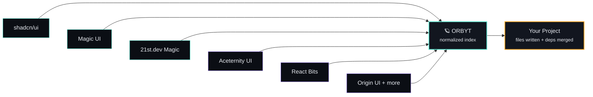

# 🪐 Orbyt

<div align="center">
  <h3><b>into your AI's hands.</b></h3>
  <p>A single MCP server that proxies the component libraries that already speak MCP, adapts the ones that don't, and hands your AI assistant one consistent way to search, fetch, and install UI — instead of ten different tools with ten different shapes.</p>
</div>

| Pattern | Primary Stack | Distribution | Tool Surface |
| :--- | :--- | :--- | :--- |
| **domain-specific meta-MCP** | TypeScript • Node | `npx init` (same as shadcn) | 6 tools, not 60 |

<br>



<div align="center">
  <p><i>Two ingestion lanes, one normalized component, one install path.</i></p>
  <span>
    <font color="#5EEAD4">■</font> <b>Lane A</b> – proxy (has MCP) &nbsp;&nbsp;&nbsp;&nbsp;
    <font color="#A78BFA">■</font> <b>Lane B</b> – adapter (scrape/registry)
  </span>
</div>

---

## ⚡ Quick Start

### 1. Install & Initialize
Run the interactive onboarding CLI in your project root. It will create `orbyt.config.json` and configure your editor of choice:
```bash
npx orbyt init --client claude
```
*(Supports `--client cursor`, `--client vscode`, `--client windsurf`, and `--client claude`)*

### 2. Configure Sources
Customize enabled sources in `orbyt.config.json` (created in your project root):
```json
{
  "framework": "next",
  "styling": "tailwind",
  "aliases": {
    "components": "@/components/ui"
  },
  "sources": {
    "shadcn": { "mode": "proxy", "enabled": true, "command": "npx shadcn@latest mcp" },
    "magicui": { "mode": "proxy", "enabled": true, "command": "npx @magicuidesign/mcp@latest" },
    "aceternity": { "mode": "adapter", "enabled": true, "baseUrl": "https://ui.aceternity.com" }
  }
}
```

### 3. Run
Launch the server in stdio mode (usually handled automatically by your editor/client):
```bash
npx orbyt
```

---

## ✨ Features

- **Ingestion Lanes**: 
  - **Lane A (Proxy)**: Communicates over stdio with existing MCP servers (e.g. shadcn, Magic UI) and translates their outputs.
  - **Lane B (Adapter)**: Directly reads public JSON registries of non-MCP libraries (e.g. Aceternity, React Bits, Origin UI) for clean component fetches without HTML scraping.
- **Fuzzy Matching**: Powered by `fuse.js` to rank and find components by keywords, description, categories, and tags.
- **Background Sync**: Stale cache entries refresh silently in the background, keeping searches fast.
- **Robust Path Resolution**: Dynamically reads local `tsconfig.json` or `jsconfig.json` to resolve custom path aliases (like `@/*` or `~/*`) to the correct local directories.
- **Pinned Dependency Merging**: Query NPM registry to resolve exact latest versions of dependencies and merge them cleanly into the project's `package.json`.
- **Framework & License Guardrails**: Fails loudly and safely if you attempt to install a framework-mismatched or non-permissive licensed component.

---

## 🛠️ Tool Surface

Orbyt keeps the context window clean by exposing a minimal, highly-specialized tool set:

| Tool | Parameters | Description |
|------|------------|-------------|
| **`list_sources`** | None | Returns connected sources, status, and configuration details. |
| **`search_components`** | `query: string`<br>`framework?: string`<br>`style?: string` | Performs weighted fuzzy search over local index with lazy background revalidation. |
| **`get_component`** | `id: string` | Fetches complete file contents, dependencies, and metadata for a specific component. |
| **`install_component`** | `id: string`<br>`targetPath?: string`<br>`dryRun?: boolean`<br>`acknowledgeLicense?: boolean` | Installs component code, resolves and merges `package.json` dependencies, and returns Tailwind config additions. |
| **`get_theme_tokens`** | `sourceLib: string`<br>`baseColor?: string` | Fetches CSS variable configuration tokens from the source library. |
| **`refresh_source`** | `sourceName: string` | Forces cache invalidation and pulls a fresh catalog for the specified library. |

---

## ⚙️ Configuration Reference

| Option | Description | Type | Default |
|--------|-------------|------|---------|
| `framework` | Project framework constraint | `"next" \| "react" \| "vue" \| "svelte" \| "react-native"` | `"react"` |
| `styling` | Core CSS / styling system | `"tailwind" \| "css-modules" \| "styled-components" \| "plain-css"` | `"tailwind"` |
| `aliases.components` | Import path alias for writing components | `string` | `"@/components/ui"` |
| `cacheTtlMs` | Cache lifetime for source registries | `number` | `86400000` (24h) |
| `sources` | Record of enabled Proxy and Adapter engines | `object` | *Standard presets* |

---

## 📂 Project Structure

```text
src/
  index.ts                    Server bootstrap (stdio MCP connection)
  cli.ts                      Onboarding & interactive prompt initiator
  config.ts                   Orbyt configuration parser & Zod schema validation
  schema.ts                   Normalized OrbytComponent & search result definitions
  store.ts                    JSON flat-file caching index with Fuse.js searching
  sources/
    types.ts                  General OrbytSource interface
    registry.ts               Sources registration dispatcher
    proxy/
      mcpProxySource.ts       Plumbing wrapper for spawning sub-MCP server processes
      shadcn.ts               Proxy mapper for shadcn/ui mcp server
      magicui.ts              Proxy mapper for Magic UI mcp server
    adapter/
      registryJsonAdapter.ts  Universal adapter for registry.json endpoints
      aceternity.ts           Adapter for Aceternity UI component schema
```

---

## 📜 License

MIT License. Feel free to copy, modify, and distribute.
